# 计算机视觉之深度学习详细解析

### 1 机器学习与深度学习

#### 1.1机器学习

人为的给图片打上token（标签）----->机器进行学习，如下：

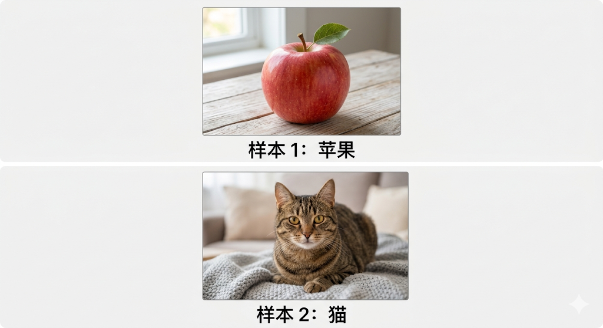

一张**256x256x3**的RGB三通道（红色，绿色，蓝色）图片，其中有256x256x3=**196608**个参数，每个像素的颜色由3种不同颜色按不同比例组成，每个颜色分量的取值范围为[0-255]存储在计算机中。所以可以把一张RGB图片想象为三张不同颜色的图片堆叠而成。

每个图像有其特征，轮廓，颜色，质感等，机器学习中计算机无法直接看到图片，只有大量的数字数据，所谓打上token就是人给组成图像的数字参数去分类然后定义特征，让计算机能识别图片中的各种事物。

**例子（认苹果）：** 

人类专家写代码计算：这图里**红色像素占多少百分比**？**圆形轮廓有多少个**？**有没有褐色细长条（茎）**？这些数字（红色的比率、圆形的数量）就是人工提取的特征。模型通过学习这些数字和标签（“苹果”）之间的数学关系来认图。

但是这种方法有严重的“**痛点**”，就是需要对每种事物单独写一套特征来帮助机器学习。

#### 1.2 深度学习

图片（像素数据）直接给计算机自己学习特征识别事物。

**1.2.1 三种深度学习方式**

监督：机器识别大量带着人为打上标签的图片，🐱<---“这是猫” ✔   🐖<---“这是猫” ×  直达学会。（目前绝大多数使用的策略）

无监督：自己去找规律没有标签，按自己的想法分类。

增强：没有静态的数据集，让机器在动态环境里通过“挨打和吃糖”的不断试错来摸索出最优的行动策略。

### 2 卷积神经网络

#### **2.1 输入与特征

卷积神经网络是深度学习中一个重要的模型，之前的图像处理一般是将图像拉平，每个RGB像素点的颜色为[R,G,B]

有一个224x224的RGB图片，有224x224个像素，3个通道，总参数为224x224x3，所谓拉平就是将像素点的数据以一维向量输入计算机，例：**（R1,G1,B1,R2,G2,B2,R3,G3,B3,R4,G4,B4）**

​                                                                                                         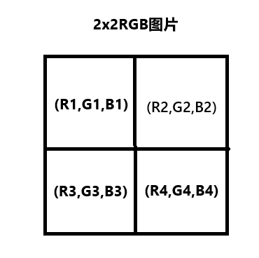 

但是这样处理的图像像素过大后会导致一次输入计算机的数据十分多，可能会使显存不足，而且十分反直觉，因为图像的核心是像素的空间相对位置，比如花的边缘、轮廓、纹理走向，而这些在拉平后被破坏无法体现，而且人识别图像是从局部特征到整体特征。

#### 2.2 全流程

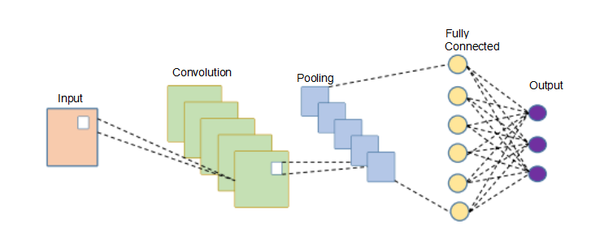

分层：卷积层，激活函数，池化层，全连接层，损失函数

例如输入一个花朵图像判断是郁金香，牵牛花还是百合

输入一个RGB花朵图像--->卷积层（提取边缘，颜色等低级特征）--->激活函数（引入非线性）--->池化层（降维+特征压缩）--->重复进行卷积，激活，池化（提取花瓣形状，花型轮廓等中高级特征）--->全连接层（整合全局特征）--->soft输出层（输出3个类别的分类概率）--->计算损失函数后反向传播进行反复修改卷积核

#### 2.3 卷积层

##### 2.3.1 卷积核

**卷积核**（Kernel/Filter）**[核高，核宽，输入通道数]** 其中所含的参数是为了提取自己想要的特征（边缘，颜色，去噪），卷积核的输入通道数要与图片通道数一致

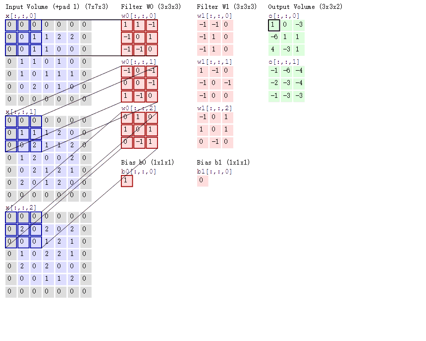

如图是一个5x5x3的图像，步长为2，**填充为1（0填充）**，有2个卷积核(**W0,W1**)都是3x3x3，对应的偏置分别为1，0，图像每个通道的图像所表示的数值都不同，卷积核的3个通道中数值也不相同，卷积过程为每一个对应位置相乘，最终结果相加。

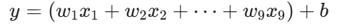

**w**为权重，**x**为像素，还要加上一个独立偏置项**b**

 每一个卷积核对应图像的一种特征，使用卷积核从图像的左上角从左至右，从上到下的依次扫过图片的目的就是完整提取图像每个像素点的特征，根据公式，可以得到卷积后的图像大小，池化层也相同

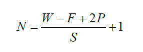

其中N：输出大小，W：输入大小，F：卷积核大小，P：填充值的大小，S：步长大小

在这里要注意是否填充和步长的选取会对图像提取的特征产生影响，如果无填充，图像就越卷越小会丢弃边缘提取的一些特征信息，因为边缘像素被卷积核扫到次数少于中心的部分。不同的步长得到的特征图大小也不同。当步长较小时，相当于慢慢的提取特征，细粒度的提取特征，特征提取 的较为丰富；当步长较大时，相当于大刀阔斧的提取特征，特征数目较少。

现在CNN卷积核的数值由机器随机设置，扫描图片（一只猫）不正确则要反向调整追责一直重复直到模型的正确率符合我们的需求。

##### 2.3.2 权值共享

卷积层有两大核心特征，之一是**权值共享**和**局部感受野**

回想之前所说,传统机器学习 用全连接神经网络来处理图片，第一步就是要把二维的图片”拉平“为一维的数组如果有一张1000x1000的高清图片，拉平后就是100万个像素点，如果下一层有1000个神经元，那么这一层光权重参数就10亿个，这不仅会让显存爆炸，它也彻底破坏了图像的二维空间结构，原本紧挨着的像素（比如构成一条边缘的像素点）被硬生生扯远。

**CNN**解决这个的措施其一就是权值共享，传统网络给图片的每一个位置都分配了独立的权重，如果它在图片的**左上角**学会了识别某个特征，当这个特征跑到图片**右下角**时，他就完全不认识了，必须重新学习比如：假设**像素 1、2、3** 经常出现某种边缘特征。经过训练，连接像素 1、2、3 的权重（设为 W1、W2、W3）变得对这种边缘极度敏感。网络学会了：“当 W1、W2、W3 接收到特定信号时，代表有边缘”。当同样的边缘出现在**像素 7、8、9** 时，负责传递信号的是完全不同的另一套权重（W7、W8、W9）。因为在之前的训练中，右下角可能从来没出现过这个边缘，W7、W8、W9 根本就没被训练过。

假设我们有一张**3x3**的图像，共有 9 个像素，按顺序拉平后是：

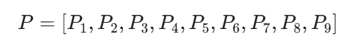

我们要找的特征是一条**“高亮的横线”**（像素值为 1，背景为 0）。在训练集中，这条横线**总是出现在图像的最顶部**（也就是P1,P2,P3的位置）。所以，每次喂给机器的正确图像数据都是：                                                                     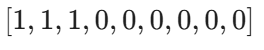

网络里有一个神经元专门负责识别这个“横线”。它手里牵着 9 根线，对应 9 个权重：

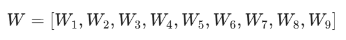

经过几千次训练，这个神经元发现：**“只要 P1,P2,P3是 1，就是横线！底下那些像素根本没用。”**

于是，它把负责P1,P2,P3的权重调得极高（比如 10），把中间的权重归零，而底部 P7,P8,P9因为在训练中全是黑的（0），权重根本没得到有效更新，维持着初始的随机乱码（假设是-2,1,-1）。

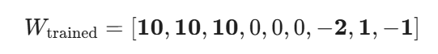

打分的公式是：
$$
\sum (P_i \times W_i)
$$

$$
Score = (1 \times 10) + (1 \times 10) + (1 \times 10) + 0 + \dots + 0=30
$$

现在，现实环境变了，摄像头稍微往下移了一点。那条一模一样的横线，**出现在了图像的底部（P7,P8,P9）**。图像数据变为

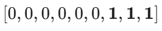
$$
\mathbf{Score = -2}
$$
面对一条完全一样、只是换了位置的横线，这个神经元算出的得分是 **-2**。经过 ReLU 激活函数（过滤负数），输出直接变成 **0**。**网络彻底瞎了，它给出的结论是：“图中没有任何横线”。**原因正是它只能判断“当 1、2、3 的数值为 1 时是横线”，它手里那套负责 7、8、9 的随机权重（-2, 1, -1）根本就不具备识别横线的能力。

**CNN 的解法（权值共享）：** 也就是拿同一个“滑动窗口（卷积核）”去扫 1、2、3，接着再往下滑动去扫 7、8、9。因为用的是同一套权重参数，所以**只要它在左上角学会了，全图任何角落它都能瞬间认出来。**

##### 2.3.3 局部感受野

卷积层另一个核心特征，就是**局部感受野**

**传统机器的视角（全局连接）：** 每一个神经元都要死死盯着整张图片的每一个像素点。这就好比让你去质检一个巨大的零件，你非要站在 10 米外把整个零件的每一个反光点都同时看清，结果什么细节都抓不住。

**CNN 的视角（局部感受野）：** CNN 认为，**图像具有极强的“局部相关性”**。你要找一条边缘、一个斑点，根本不需要看全图，只需要看周围的一小块区域就行了。

比如你的 3x3卷积核，它的“视野（感受野）”就只有这 9 个像素。它像一个拿着放大镜的质检员，一点一点地贴着图片看 它尊重了二维图像的物理意义，知道像素是挨在一起才形成形状的。**极大地砍掉了参数量** 神经元不再需要和全图 100 万个像素连线，它只需要和感受野里的 9 个像素连线。计算量呈指数级断崖式下跌。

#### 3 激活函数

激活函数是神经网络中的一部分，用于将神经元的输入映射到输出端。卷积本质上是进行线性运算，多个线性层等效于一个线性层的作用，无法拟合那些弯弯曲曲的边界和复杂的非线性特征。激活函数增强关注的特征并减少不关注的特征。激活函数它具有普通函数的特性，并引入**非线性特征**，通常位于上一层的输出和下一层的输入之间，并作为下一层的输出。激活函数的位置如图所示。激活函数有多种类型，具有不同的优缺点和适用范围。

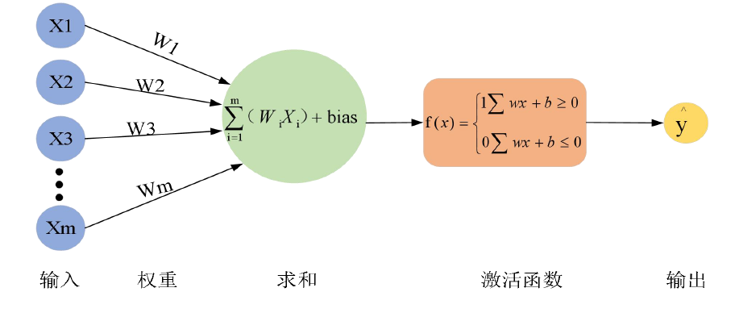

#####  3.1 Sigmoid函数

是一个S型函数，表达式为在函数值趋于无穷时越平滑，输出范围在0 到1 之间，常用于二分类。缺点是容易发生梯度消失、计算含幂运算时耗时、输出为非0均值导致收敛缓慢。

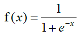

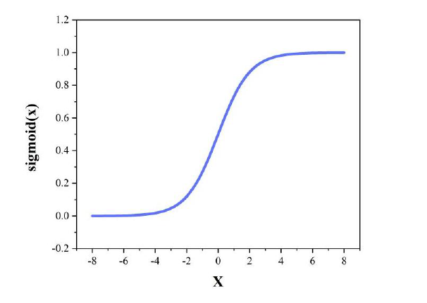

**补充请见6.2**

##### 3.2 tanh函数

tanh 函数是Sigmoid 函数的变形，以0为中心，取值范围为-1到1

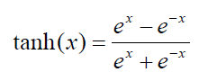

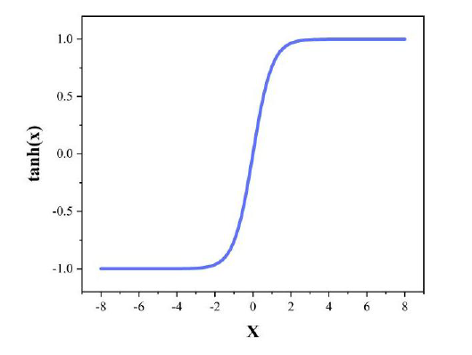

**补充请见6.2**

tanh 函数相较于Sigmoid 函数的曲线更加平滑，解决了Sigmoid 函数输出零点不对称的问题，缓解了梯度消失问题，但该函数的缺点是运算量较大。

##### 3.3 ReLU函数

该函数是一种取最大值的函数，是目前最常用的激活函数

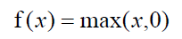

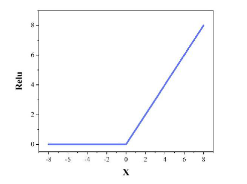

**补充请见6.2**

ReLU 函数保留正数元素、清零负数元素，解决正区间梯度消失。缺点是不具有非零均值，某些神经元难以激活，导致参数无法更新。收敛速度远快于Sigmoid 函数

#### 4 池化层

池化层的作用是进行特征压缩与降维，所做的一切是为了保卫显存，图像经过卷积核卷积过后提取相应的特征，一个图像可能要提取很多个特征所以经过一层卷积层后依然会得到很多的特征图像。

**降维减参，降低计算量**：将特征图的尺寸缩小，减少后续层的参数和计算量，比如 2×2 的池化可以让特征图面积直接变为原来的 1/4。

**特征压缩，提升鲁棒性** ：保留特征图中的核心有效特征，过滤冗余的细节信息，让模型具备**平移不变性**------ 即使花朵在图像中稍微移动，池化后的核心特征仍然保持一致。

**扩大感受野**：随着特征图尺寸缩小，后续层的单个卷积核可以覆盖到原始图像更大的区域，更好地学习全局特征。

##### 4.1 主流池化方式详解

池化层的通道数和输入特征图完全一致，仅改变特征图的高和宽，核心有两种方式：

###### 4.1.1 最大池化（Max Pooling）

CNN 中最常用的池化方式，核心逻辑是在池化窗口内，取最大值作为输出，这里要注意的是对所有通道都进行池化如果经过16个卷积核的作用生成了16层的特征图像后，池化层也要一层层的进行作用，之后也是生成一个16通道的图像。

常用配置：2×2 的池化窗口，步长 S=2，无填充，输出尺寸正好是输入的 1/2。

优势：能很好地保留纹理、边缘等强特征，符合视觉特征提取的需求，在分类任务中效果远优于**平均池化**。

**示例**：4×4 的特征图，经过 2×2 最大池化、步长 2 后，输出 2×2 的特征图，每个值都是对应 2×2 窗口内的最大值。

###### 4.1.2 平均池化（Average Pooling）

在池化窗口内，取所有像素的平均值作为输出。

优势：更适合保留全局的背景、亮度等特征，对整体信息的保留更好。

工业界应用：现在极少用于中间层的降维，更多用于网络的最终层 ------**全局平均池化（GAP, Global Average Pooling）** ，将每个通道的整个特征图取平均值，直接把`[Heigh,Width,Channel]`的三维特征图变成`[1,1,C]`的向量，替代全连接层大幅减少参数，防止过拟合。

例如经过多层卷积后得到了16张特征图像，对每一个特征图像进行**GAP**后，就会得到**[1,5,6,7,1,1,8.9,7,5,1,0,2,5,10,2,5]**这样的数据，这样就可以赋予每个通道明确的”物理意义“，比如**通道1**负责找“**锐利边缘**”，GAP是9.8这就说明图中有大量这种边缘。

池化层的输出尺寸计算公式和卷积层完全一致，常用的 2×2 池化、步长 2、无填充，输出尺寸正好是输入的 1/2。

**实战示例**：conv1 输出的 16x16x500x500的特征图，经过 2×2 最大池化后，输出尺寸变为 16x16x250x250，尺寸减半，核心特征完全保留。这里的16x16是一次性输入计算机16张不同的图片，经过16个卷积核卷积后生成的每一张图片都是16通道的。

#### 5 全连接层与输出层

##### 5.1 全连接层

经过多层卷积 - 激活 - 池化的堆叠，我们已经从原始图像中提取到了丰富的高级特征，接下来就需要全连接层完成最终的分类决策。

如上文所说经过池化后生成很多的特征图像，我们GAP展平为一个一维的特征向量，这样我们可以得到**[1,5,6,7,1,1,8.9,7,5,1,0,2,5,10,2,5]**这样的特征向量，而这些数据又会根据各自的权重加上偏置值送给全连接层去判断。

举例：需要判断花朵图片是否是郁金香，在全连接层有3个神经元，分别对应郁金香，牵牛花，百合，每个图片经过多层卷积都可以获得一张16通道的特征图像，假如对计算机中训练的一张图像，卷积后产生的16张特征图像GAP得到**[1,5,6,7,1,1,8.9,7,5,1,0,2,5,10,2,5]**，数字大小代表对应特征在图像中是否充足或者明显。而郁金香的图片对应的特征是[x,x,10,10,x,x,10,10,x,x,x,x,x,x,x,x],于是神经元会专门为第3，4，7，8个通道极高的权重，比如
$$
W_3=2.0, W_7=2.5
$$
对于其他不相关的通道赋予极低的权重，甚至是负权重，当图像特征送进来时，郁金香神经元会做一个加权求和计算：
$$
Score = (1 \times W_1) + \dots + (\mathbf{6 \times 2.0}) + (\mathbf{8.9 \times 2.5}) + \dots + b
$$
全连接层最后得到一个评分，可能为**[8.5，2.1，0.4]**数字大则代表可能性越大

##### 5.2 输出层

它是神经网络本体架构的最后一层，数据走到这里前向传播就完成了，这里会把神经元的评分转化为人类或者后续系统可以看懂的格式，比如**[8.5，2.1，0.4]**，输出层会套上一个**Softmax**函数，把它们强行转换为加起来等于100%的概率值比如**[88%，11%，1%]**

#### 6 损失函数

当模型训练完毕，对于输出层给出的结果进行“算分和找茬”

对于预测结果可能是88%，预测是郁金香的概率，但是我们人为已经定下标准必须要预测率为99%以上，那么它就会一套极其严厉的数学公式，比如交叉熵损失**CrossEntropy**，或者是均方误差**MSE**，算出与正确结果之间巨大的分歧(**Loss值**)，我们需要进行反向传播不断的修改卷积核的数值再次提取特征，因为可能是“提取红色特征”卷积核中的一个权重过大过小而导致最后模型拟合效果不佳，所以要不断的修改使得Loss值趋近于所设定的正确预测图像的数值。

这里要注意到，我们在进行方向传播去反复修改卷积核的时候，通过微积分的链式法则看哪一层某个权重给低或者高，修改后
$$
w_{new} = w_{old} - (学习率 \times 梯度)
$$
##### 6.1 梯度与学习率

在这里利用一个极其生动的场景：**“蒙眼下山”**来解释什么是**学习率和梯度**。

假设一个人（代表计算机）被蒙上了眼睛，扔在了一座高低起伏的山脉中。

**你的目标：** 走到这座山的**最低谷**。

**山的海拔高度** :代表**误差（Loss）**。海拔越高，说明你错得越离谱；走到谷底（海拔最低），说明误差最小，模型就训练完美了。

**你脚下的坐标（经纬度**）：代表当前的**权重参数$w_{old}$**，也就是你一开始随机瞎猜的那个卷积核里的数字。

现在，你被蒙着眼，怎么走到谷底呢？这就是梯度和学习率登场的时候了。

##### 6.1.1 什么是“梯度” (Gradient)？

既然你看不见整座山，你只能用脚去踩一踩周围的地面。

**梯度，就是你当前脚下地面的“倾斜程度和方向”。**

**在数学上：** 梯度是一个向量（导数），它永远指向这座山**“最陡峭、向上的方向”**。

**你的动作：** 既然梯度指的是“往上走最陡的方向”，而你的目标是“下山（减小误差）”，所以你必须**反着梯度的方向走**。

**破解公式里的减号：** 这就是为什么公式里是 $w_{old}$ **减去**梯度！梯度指向上，你偏要减去它，也就是往下走。

同时，梯度不仅告诉你方向，还告诉你**坡度有多陡**。如果坡很陡，梯度这个数值就很大；如果已经快到平坦的谷底了，梯度就会变得非常小，接近于 0。

##### 6.1.2 什么是“学习率” (Learning Rate)？

好，现在你用脚探明了方向（梯度），准备往下迈步了。但是，**这一步该迈多大呢？**

**学习率，就是你决定迈出的“步子大小”。**

在公式里，梯度是一个客观存在的客观环境数据，而**学习率是你（人类工程师）人为设定的一个乘数**（通常是一个很小的小数，比如 0.01、0.001）。

不同的学习率会带来截然不同的下山结果：

**学习率太大（比如 1.0）：跨栏选手。**

步子迈得太大！你可能一脚直接跨过了最低谷，踩到了对面的半山腰上。下一步你又往回跨，结果在两个山头之间反复横跳，海拔越来越高（误差越来越大）。这在深度学习里叫**“震荡”甚至“梯度爆炸”**。

**学习率太小（比如 0.00001）：蜗牛漫步。**

步子迈得极碎。虽然你确实在往下走，但走得太慢了。等到天黑（算力耗尽或训练时间结束），你可能才挪动了半米，根本没走到谷底。或者你不小心走进了一个浅浅的小坑（局部最优解），以为到了谷底就停下了。

**合适的学习率：** 步子不大不小，稳稳当当、顺滑地走到谷底。

只要计算机对着几万张图片，疯狂重复这个公式几百万次，那个原本随机瞎猜的参数 $w$，就会一点点滚落到误差最小的谷底，变成一个完美的特征提取器。

##### 6.2激活函数（补）

之前我们提到**Sigmoid函数**缺点是容易发生梯度消失、计算含幂运算时耗时、输出为非0均值导致收敛缓慢。

(1)首先是梯度消失，Sigmoid函数$f(x) = \frac{1}{1 + e^{-x}}$ 的导数就是梯度$f'(x) = f(x)(1 - f(x))$

这个导数在x=0时取得理论最大值：0.25

也就是说，哪怕是在最完美的情况下，每经过一层 Sigmoid 激活函数，梯度（误差信号）**最多也只能保留原来的四分之一**。一旦输入稍微偏大或偏小（比如 $x=5$ 或 $x=-5$），导数就极其贴近于 $0$ 了。

反向传播修改参数，靠的是链式法则（连乘）。假设你有一个 10 层的网络，误差从第 10 层往回传：

$$0.25 \times 0.25 \times 0.25 \dots \text{(连乘 10 次)} \approx 0.00000095$$

结果就是：传到最前面的第 1 层和第 2 层时，**梯度已经变成了 0**。底层的卷积核根本接收不到任何修改信号，参数永远不更新，网络彻底“脑死”。

(2)再就是计算含幂运算耗时

在计算机的 CPU 和 GPU 底层电路中：

做加法、减法、乘法，甚至求最大值（比如 ReLU 的 $\max(0, x)$），速度是**闪电般**的，只需几个时钟周期。

但是算指数 $e^{-x}$，计算机底层其实是在做极其复杂的**泰勒级数展开**（用无穷多项的多项式去逼近它），涉及大量的浮点数乘法和加法。

**灾难后果：**当你有一张高清图片，网络里有几百万、上千万个神经元需要同时激活时，千万次极其昂贵的 $e^{-x}$ 计算，会严重拖慢整个模型的训练和推理速度。相比之下，ReLU 只需要判断一下“这个数是不是大于 0”，速度快了成百上千倍。

（3）Sigmoid 的输出永远在 $0 \sim 1$ 之间，这意味着**它吐出来的数字全都是正数**。

连锁反应： 既然上一层的输出全是正数，那么当前这一层神经元接收到的所有输入数据 $X_1, X_2, \dots$ 也**全都是正数**。

当我们计算某个神经元里权重 $w_i$ 的梯度时，公式大致是：

$$\text{权重梯度} = \text{上游传来的总梯度} \times \text{激活函数导数} \times X_i$$

**$X_i$：** 永远是正数（因为上一层用了 Sigmoid）。

**激活函数导数：** 永远是正数（$0 \sim 0.25$ 之间）。

**上游传来的总梯度：** 这个数字要么是正，要么是负。

**灾难后果：**

这意味着，对于这同一个神经元里的所有权重（$w_1, w_2, w_3 \dots$），**它们的梯度符号完全一模一样**！

如果上游传来正梯度，所有权重只能**集体变大**；如果传来负梯度，所有权重只能**集体变小**。

**这就好比：** 假设系统最优解在你的**东南方向**（需要 $w_1$ 往东变大，$w_2$ 往南变小）。

但因为被捆绑了，机器在这一步要么集体往东北走 $(+,+)$，要么集体往西南走 $(-,-)$。为了到达东南方，机器只能极其别扭地走出一条**“之”字形的折线**（走一步东北，再走一步西南，慢慢往东南方向蹭）。这导致网络训练的时间被大幅度拉长。

tanh函数的缺点是运算量甚至比Sigmoid的还大，因为$$f(x) = \tanh(x) = \frac{e^x - e^{-x}}{e^x + e^{-x}}$$，而且梯度消失也没有解决。
